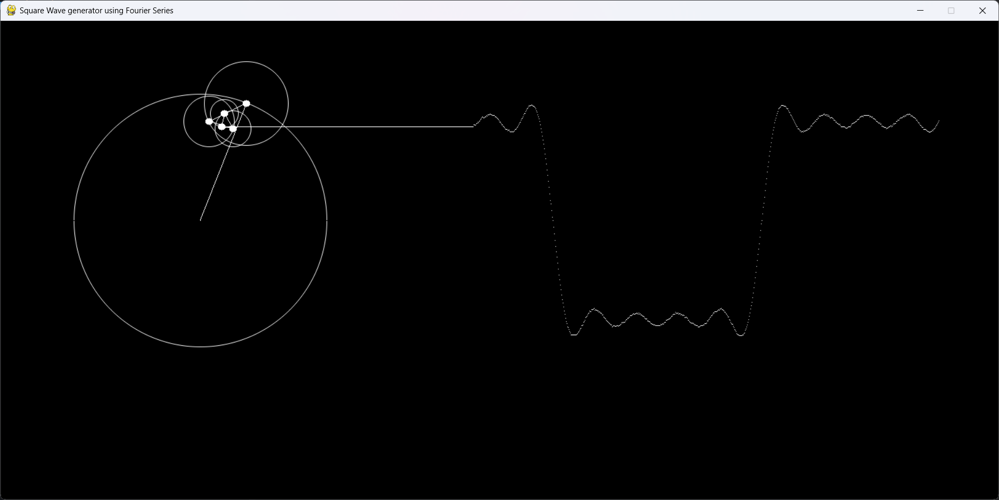

# Square Wave Visualization in python with Fourier Series

A simple Square Wave Visualization which demonstrates the use of Fourier Series

## Description

This project demonstrates Fourier Series to generate a square wave using:

$$
f(t) = \frac{4}{\pi} \sum_{n=1,3,5,\dots}^{\infty} \frac{1}{n} \sin(nt)
$$

## Requirements

- Python 3.8 or higher
- pip for package installation
- pygame

## Installation

Step-by-step instructions to set up the project.

1. Clone the repository:
```cmd
git clone https://github.com/plum-berry/square-vis-fourier.git
```
2. Navigate to the project directory:
```cmd
cd square-vis-fourier
```
3. Install dependencies:
```cmd
pip install -r requirements.txt
```

## Usage
Run with argument n (number of sine waves):
```cmd
python main.py 5
```
This shows approximation using 5 sine waves.



Try higher values

```
python main.py 10
```

As n increases the approximation converges to a square wave.

## Contributing

Guidelines for contributions.

1. Fork the repository
2. Create a feature branch  
3. Submit a pull request
